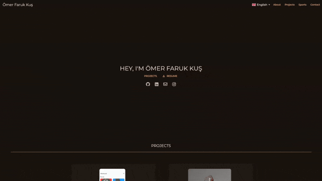
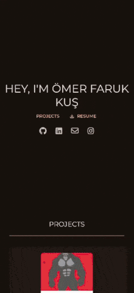

# 🌐 Personal Portfolio Website

<p align="center">
  
  &nbsp;&nbsp;&nbsp;&nbsp;
  
</p>

> **Live Demo:** [www.omerfarukkus.com.tr](https://www.omerfarukkus.com.tr/)

## 📌 Project Overview
This repository contains the source code for my personal portfolio website, developed entirely from scratch using **Flutter**. 

While my primary engineering focus is on C++, Python, and AI-driven robotics, I built this website to maintain a centralized digital footprint and to demonstrate my ability to write clean, maintainable, and responsive frontend code.

---

## 🛠️ Engineering & Architecture
I intentionally kept this repository public to serve as a reference for my coding conventions and architectural approach.

* **Clean Architecture:** The codebase is strictly organized into distinct layers, ensuring scalability, readability, and easy maintenance.
* **Responsive Design:** Engineered using Flutter's dynamic widget tree to provide a seamless, native-feeling user experience across desktop browsers, tablets, and mobile devices.
* **State Management & Optimization:** Minimized unnecessary widget rebuilds to ensure a smooth, lag-free performance on the web.

---

## 🚀 Local Setup & Review
If you are a technical recruiter or engineering manager who would like to review the source code in action, you can run this project locally:

```bash
# Clone the repository
git clone [https://github.com/omrfrkkus/Personal-Portfolio-Website.git](https://github.com/omrfrkkus/Personal-Portfolio-Website.git)

# Navigate to the directory
cd Personal-Portfolio-Website

# Install dependencies
flutter pub get

# Run the project (Chrome/Web)
flutter run -d chrome

```

---

## 📬 Contact

* **Email:** [omerfaruk.kus@outlook.com](https://www.google.com/search?q=mailto%3Aomerfaruk.kus%40outlook.com)
* **LinkedIn:** [linkedin.com/in/omrfrkkus](https://www.google.com/search?q=https://linkedin.com/in/omrfrkkus)